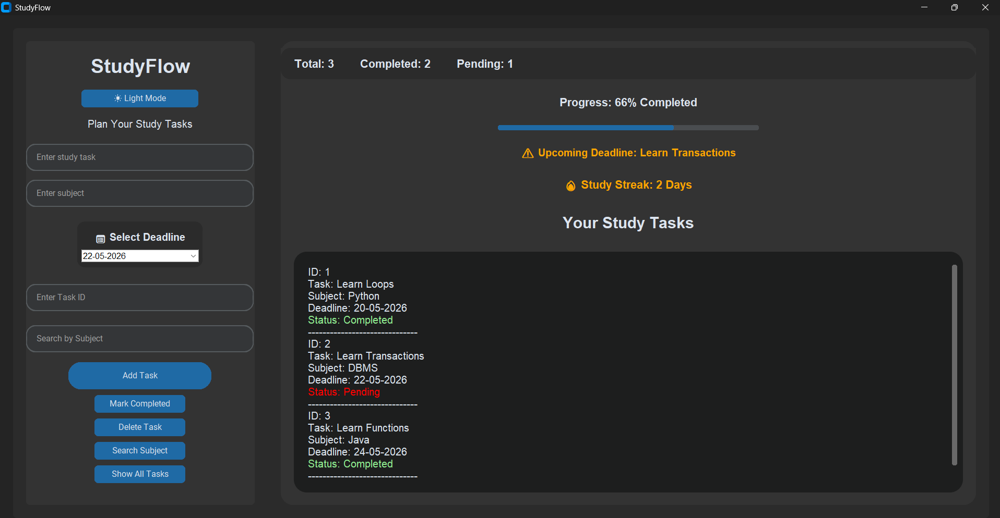

# StudyFlow

StudyFlow is a desktop-based study planner application built using **Python**, **CustomTkinter**, and **SQLite**. It helps students organize study tasks, track progress, manage deadlines, and improve productivity.

---

## Features

- Add study tasks
- Mark tasks as completed
- Delete tasks
- Search tasks by subject
- Deadline calendar
- Progress tracking bar
- Dashboard statistics
- Upcoming deadline warning
- Dark / Light mode toggle
- Study streak counter
- SQLite database storage

---

## Application Preview



---

## Technologies Used

- Python
- CustomTkinter
- SQLite
- TkCalendar

---

## Installation

### Clone Repository

```bash
git clone https://github.com/Harichandana-30/StudyFlow.git
```

### Open Project Folder

```bash
cd StudyFlow
```

### Install Requirements

```bash
pip install -r requirements.txt
```

### Run Application

```bash
python main.py
```

---

## Author

Hari Chandana